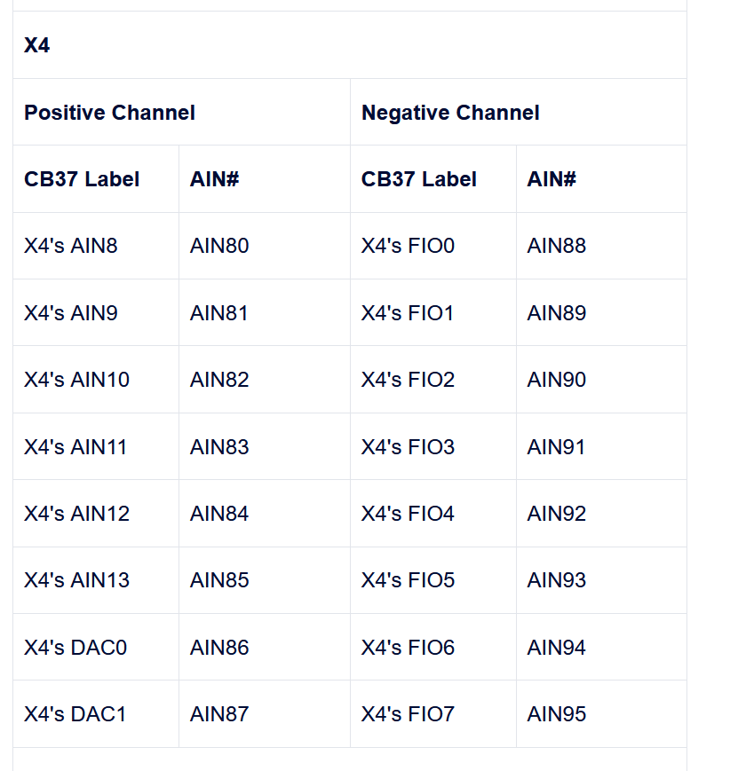

## Using differential analog inputs with mux 80
In the labjack documentation, it gives built-in support fot differential sensing with two analog inputs. To extend this, we can use the MUX-80 X4 connector, as in the image below. 

The built-in analog inputs AIN0 through AIN3 can be used normally when using the Mux80 (but AIN4 through AIN13 are not available). This allows:

    Positive channel = AIN0 paired with negative channel = AIN1

    Positive channel = AIN2 paired with negative channel = AIN3

See 14.0 AIN of the T-Series Datasheet for more details on built-in AIN.

For extended channels, the positive channel can be any channel (even or odd) listed as a positive channel in the chart below. The negative channel number is the positive channel number plus 8 (listed under the “Negative Channel” the chart below).

Example 1: The positive channel is connected to AIN102 (AIN6 on the CB37 connected to X5). The corresponding negative channel is AIN110 (DAC0 on the CB37 connected to X5).

Example 2: The positive channel is connected to AIN64 (FIO0 on the CB37 connected to X3). The corresponding negative channel is AIN72 (AIN0 on the CB37 connected to X4).

Note that for some differential pairs, the positive and negative are located on different connectors.

Table 2. Channel numbers for analog inputs based on differential connection and CB37 connector

